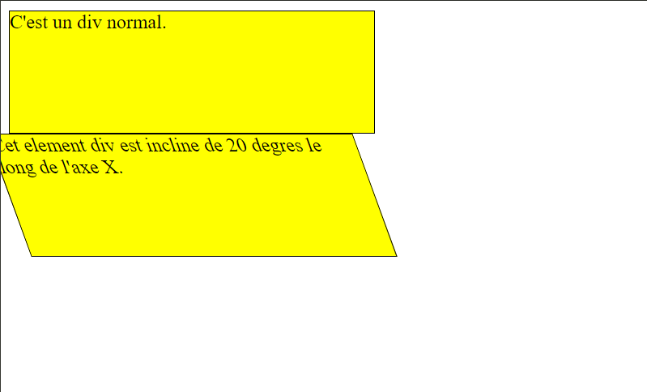

# CSS-Skew-Transformations-Shaping-Div-Elements
This HTML and CSS code delves into the world of CSS transformations, specifically showcasing the use of the transform property with the skewX function. 
Two div elements, distinguished by their classes (class="a" and class="b"), are presented. The first div represents a standard element with defined dimensions and a yellow background. The second div, however, introduces a dynamic visual effect by applying a skew transformation along the X-axis. The transform: skewX(20deg); style imparts a 20-degree incline to the second div, creating a distinct and visually engaging presentation. This code serves as an illustrative example of how CSS skew transformations can be employed to shape and enhance the appearance of HTML elements on a webpage.

